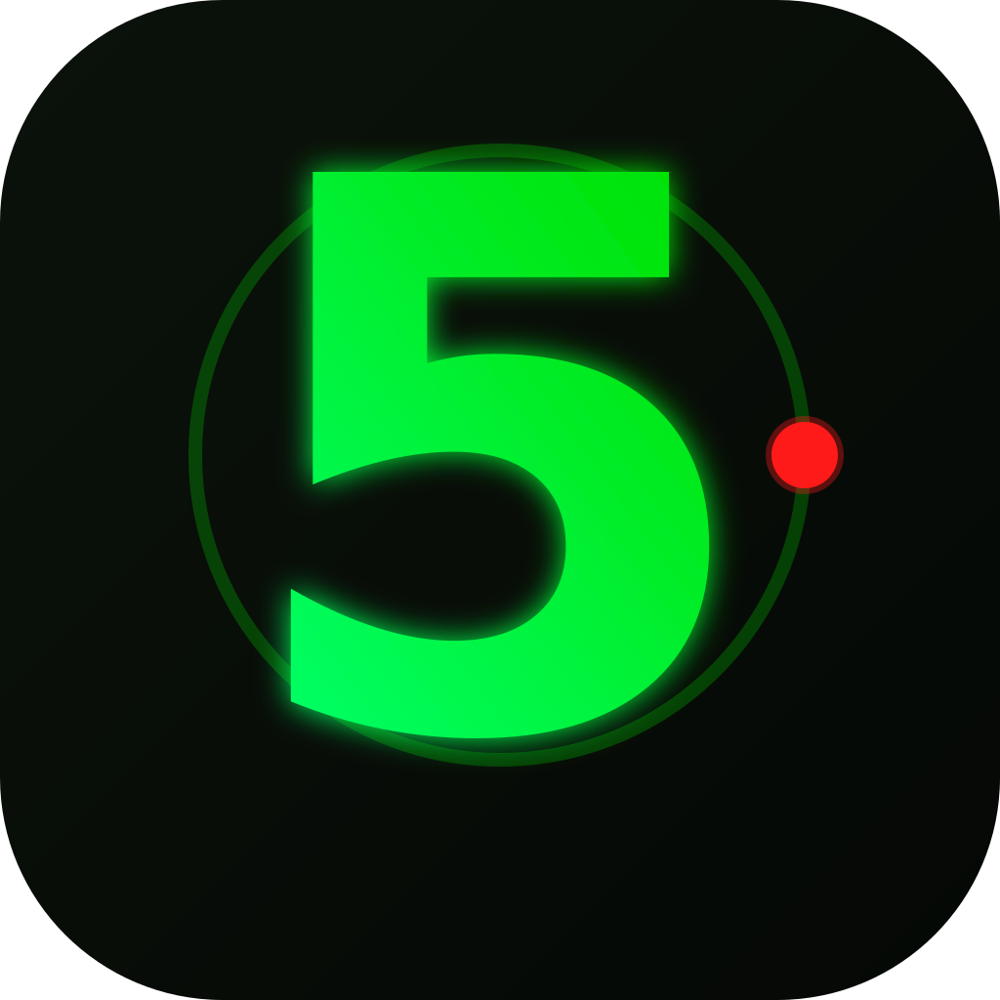
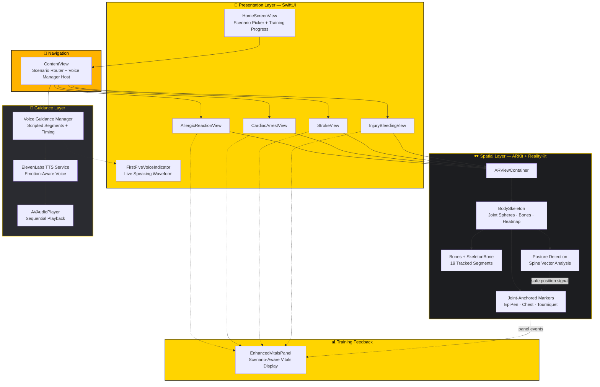
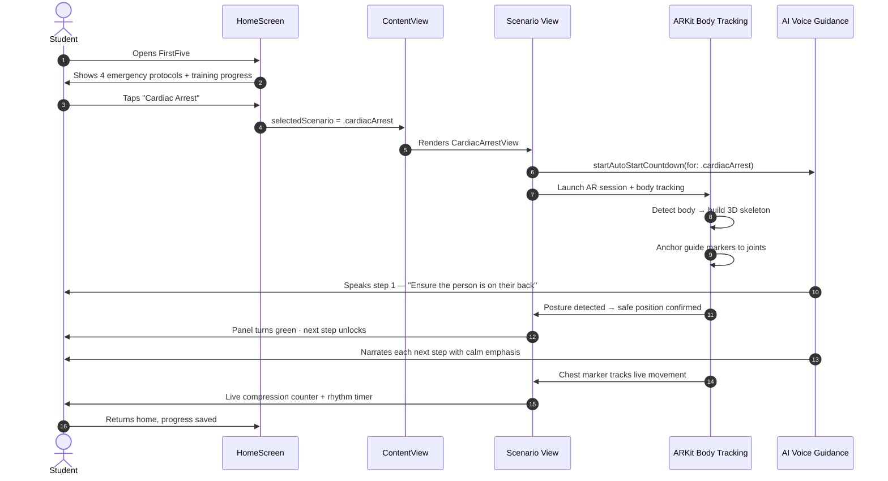
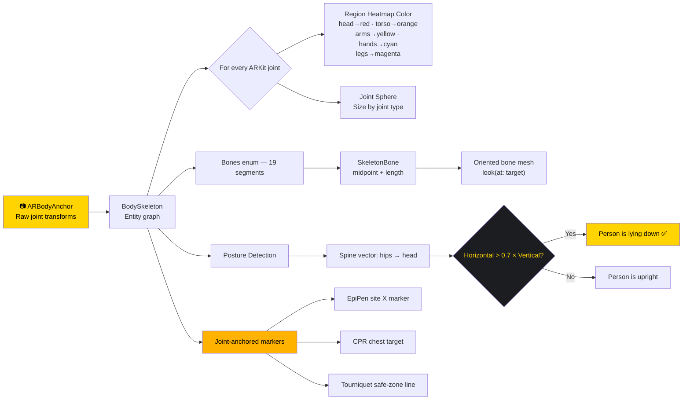
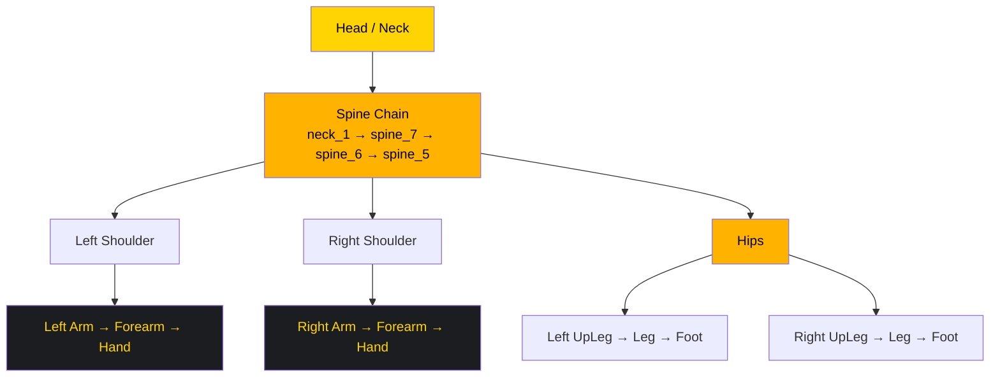
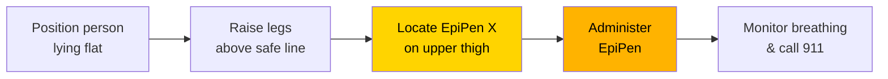
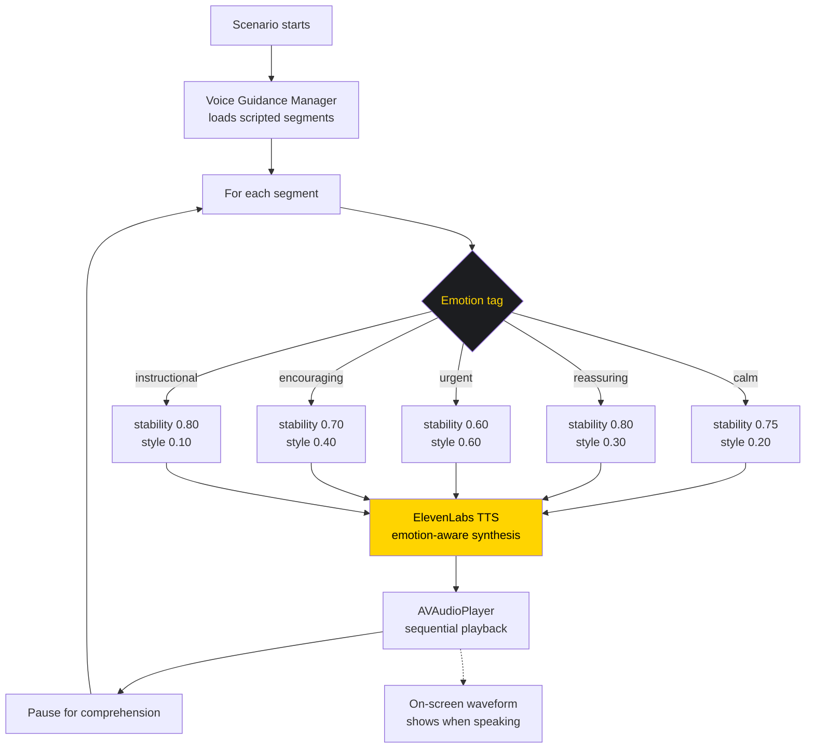
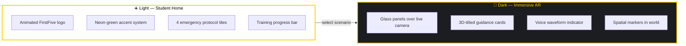

<div align="center">



# FirstFive

### The first five minutes save lives.

**An AR + AI voice first-response trainer that turns every student into a capable responder.**

<br/>

[](https://www.apple.com/ios/)
[](https://swift.org)
[](https://developer.apple.com/xcode/swiftui/)
[](https://developer.apple.com/augmented-reality/arkit/)
[](https://developer.apple.com/augmented-reality/realitykit/)
[](https://elevenlabs.io)

[](LICENSE)
[](https://github.com/digiflowhelp-stack/FirstFive/pulls)
[](#)

<br/>

> ### 🏆 CSC Back-to-School Hackathon
> Built for real school-life impact — **Education · Social Good · Beginner Friendly**

</div>

---

## The Problem

Schools teach algebra, history, and literature — but they don't teach students what to do when someone has an **allergic reaction in the cafeteria**, a **stroke in the hallway**, or a **cardiac arrest on the field**.

When a medical emergency happens at school, the people standing closest are almost never trained professionals. They are **students**. And they have about **five minutes** before the outcome is decided.

<div align="center">

### ⏱️ The first five minutes save lives. FirstFive makes every student ready.

</div>

Today, first-response training is a slideshow, a poster, or a CPR mannequin in a closet. It is passive, forgettable, and impossible to practice on-demand. Meanwhile, in a real emergency, a panicking student has no guide telling them what to do **right now, at this moment, on this person.**

**FirstFive closes that gap** by turning a phone into a **spatial, voice-guided first-response coach** that overlays instructions directly onto the person who needs help.

---

## What Is FirstFive?

FirstFive is a native iOS app that uses **augmented reality body tracking** and **AI-generated voice guidance** to walk an untrained student through four life-threatening emergency protocols — step by step, in real time, hands-free.

It watches the body in front of the camera, builds a live 3D skeleton, and **anchors life-saving instructions onto the exact joints and locations that matter** — where to place a hand for compressions, where an EpiPen goes on the thigh, where to tie a tourniquet, where to check for facial drooping.

<div align="center">

| 🫀 Cardiac Arrest | 😮‍💨 Allergic Reaction | 🧠 Stroke | 🩸 Injury & Bleeding |
|:---:|:---:|:---:|:---:|
| CPR hand placement & compression rhythm | EpiPen site location & safe positioning | FAST assessment with live face mesh | Wound marking & tourniquet training |
| Chest marker tracks the body in 3D | Pulsing injection-site indicator | Smile & symmetry analysis | Rotating wrap-direction arrows |

</div>

---

## Why It Wins

<table>
<tr>
<td width="50%" valign="top">

### 🎯 A Real School Problem
Every school has a cafeteria, a hallway, and a field — and every school has students who would freeze in an emergency. FirstFive targets the exact gap between *"someone should help"* and *"someone knows how."*

</td>
<td width="50%" valign="top">

### 🧠 Genuinely Non-Generic
Not another to-do list or flashcard app. FirstFive uses **ARKit body tracking** to place medical guidance onto a real human body — spatial instruction delivery that no slide deck can replicate.

</td>
</tr>
<tr>
<td width="50%" valign="top">

### 🗣️ Accessible By Design
Full **AI voice guidance** narrates every step, so a student can follow along with both hands busy performing the response — no looking down at a screen mid-emergency.

</td>
<td width="50%" valign="top">

### 📚 Practice + Real Response
A **Training Mode** lets students rehearse protocols with progress tracking, while **Emergency Mode** delivers calm, direct, real-time instruction when it counts.

</td>
</tr>
</table>

---

## System Architecture



---

## How It Works — Request Lifecycle



---

## The AR Body-Tracking Engine

At the core of FirstFive is a reusable spatial engine that turns ARKit's raw joint data into a readable, instructive, human-shaped overlay.



**19 tracked bone segments** spanning shoulders → arms → forearms → hands, the full spine chain, and hips → legs → feet:



---

## The Four Protocols

### 🫀 Cardiac Arrest — CPR Coach
A six-step compression protocol with a **live chest marker anchored to the spine joint**, so it physically follows the person's chest as they move.

| Step | Guidance |
|:---:|---|
| **1** | Position check — person on back, firm flat surface |
| **2** | Kneel beside the person, knees shoulder-width |
| **3** | Hand placement — heel of hand on the chest marker |
| **4** | Body position — shoulders over hands, arms locked |
| **5** | Compressions — hard and fast, 2 inches deep |
| **6** | Maintain rhythm — 100–120 compressions per minute |

The app renders a **live compression counter and stopwatch**, keeping the responder locked to a correct rhythm as the AI voice counts them through it.

### 😮‍💨 Allergic Reaction — EpiPen Guide
A guided sequence for anaphylaxis: safe positioning, locating the injection site on the thigh, administering the EpiPen, and monitoring breathing.



A pulsing **X marker** on the thigh points to the injection site, with an arrow and safe-position baseline that turns **green** once the person is correctly positioned. A cyan chair-support hint reinforces correct staging.

### 🧠 Stroke — FAST Assessment
A four-part **FAST** screening (Face, Arms, Speech, Time) with real sensor input:

- **F — Face:** builds a live **fuchsia wireframe mesh from ARKit face geometry** and reads smile blend shapes to analyze facial movement and symmetry.
- **A — Arms:** floats orange and blue target spheres in space; arm weakness is detected by comparing each **hand joint's height to its shoulder joint**. Spheres reveal progressively as each arm is raised.
- **S — Speech & T — Time:** guided prompts leading to the emergency call decision.

### 🩸 Injury & Bleeding — Tourniquet Trainer
A seven-step tourniquet workflow built on spatial tap-to-place:

1. **Mark the bleeding site** — tap the screen, a pulsing red X anchors to the wound.
2. **Apply direct pressure** — firm pressure with a clean cloth.
3. **Tourniquet placement** — a cyan safe-zone line appears 2–3 inches above the wound.
4. **Wrap direction** — six rotating orange arrows demonstrate the clockwise wrapping motion in 3D.
5. **Windlass & timer** — insert the rod, then track elapsed tourniquet time.
6. **Secure & timestamp** — lock the windlass and note the time.
7. **Verify** — check bleeding and distal pulse.

---

## Voice Guidance — Emotion-Aware AI Narration

FirstFive narrates every protocol so a student's **eyes and hands stay on the person**, not the screen.



Each spoken segment is delivered with a tailored voice profile — **calm and instructional** during teaching, **reassuring** during reassurance, **urgent** during time-critical actions — then paused for the responder to act before the next step begins.

---

## Home Dashboard & Modes



- **Emergency Mode** — direct, real-time, urgent guidance.
- **Training Mode** — practice-and-learn flow with completion tracking per protocol.

---

## Tech Stack

| Layer | Technology | Purpose |
|---|---|---|
| **Language** | Swift 5.0 | Native, high-performance iOS |
| **UI** | SwiftUI | Declarative, animated interface |
| **3D Engine** | RealityKit | Entities, meshes, materials, animations |
| **Tracking** | ARKit | Body, face, and world tracking |
| **Voice AI** | ElevenLabs API | Emotion-aware text-to-speech |
| **Audio** | AVFoundation | Audio session + playback |
| **Concurrency** | Combine / GCD | Async state propagation |
| **Build** | Xcode | iOS 18.6+, iPhone & iPad |

---

## Project Structure

```
FirstFive/
├── FirstFiveApp.swift            # @main entry point
├── ContentView.swift             # Scenario router + voice manager host
├── Config.swift                  # Voice + audio configuration
│
├── HomeScreenView.swift          # Dashboard, protocol tiles, modes
├── EmergencyScenario.swift       # 4 protocols: metadata, steps, icons
│
├── ARViewContainer.swift         # Base AR session + posture baseline
├── BodySkeleton.swift            # Skeleton engine + heatmap + markers
├── Bones.swift                   # 19 tracked bone segments
├── SkeletonBone.swift            # Bone geometry (midpoint, length)
├── SkeletonJoint.swift           # Joint model
│
├── AllergicReactionView.swift    # EpiPen protocol + AR overlay
├── CardiacArrestView.swift       # CPR protocol + chest marker
├── StrokeView.swift              # FAST assessment + face mesh
├── InjuryBleedingView.swift      # Tourniquet trainer
├── SeizureView.swift             # Seizure protocol (roadmap)
│
├── EnhancedVitalsPanel.swift     # Scenario-aware vitals display
├── FirstFiveVoiceIndicator.swift # Live speaking waveform UI
├── ElevenLabsService.swift       # AI voice synthesis client
│
└── Assets.xcassets/              # App icon + brand logo

brand/
└── FirstFiveLogo.svg             # Master logo — yellow "5" + ECG heartbeat
```

---

## Getting Started

### Requirements

- macOS with **Xcode 16+**
- **iPhone or iPad with an A12 Bionic chip or later** (required for ARKit body tracking)
- iOS **18.6+**
- An **ElevenLabs API key** (free tier works) for voice guidance

### Run It

```bash
# 1. Clone the repository
git clone https://github.com/digiflowhelp-stack/FirstFive.git
cd FirstFive

# 2. Open the Xcode project
open FirstFive.xcodeproj

# 3. Add your ElevenLabs API key in Config.swift
#    static let elevenLabsAPIKey = "YOUR_KEY_HERE"

# 4. Select your device and press ⌘R
```

> 📱 **Use a real device.** Body tracking requires the rear camera and a LiDAR/TrueDepth-capable chip — the Simulator cannot provide body anchors. Point the camera at a person and the skeleton appears.

---

## Roadmap

- [x] AR body tracking with 19-segment skeleton
- [x] Joint-anchored medical markers
- [x] Emotion-aware AI voice guidance
- [x] Four emergency protocols
- [x] Training + Emergency modes
- [ ] School-wide training leaderboards
- [ ] Multi-student classroom sessions
- [ ] Teacher dashboard with completion reports
- [ ] Offline voice pack for no-connectivity classrooms
- [ ] Additional protocols: seizure, choking, burns

---

## Team & AI Disclosure

FirstFive was built for the **CSC Back-to-School Hackathon**, whose theme asks one question: *what in your school actually needs fixing?* Our answer: **nobody teaches students what to do in the five minutes that decide whether someone lives.**

**Built by:** `digiflowhelp-stack`

**AI-use disclosure:** AI coding and design assistants were used during development for brainstorming, scaffolding, debugging, and design exploration. The architecture, protocol content, AR approach, and final product were designed, assembled, and are fully understood by the team, who can explain every component and decision.

---

<div align="center">

### ⏱️ The first five minutes save lives.

## **FirstFive makes every student ready.**


*Built with ❤️ for students, by students.*

</div>
